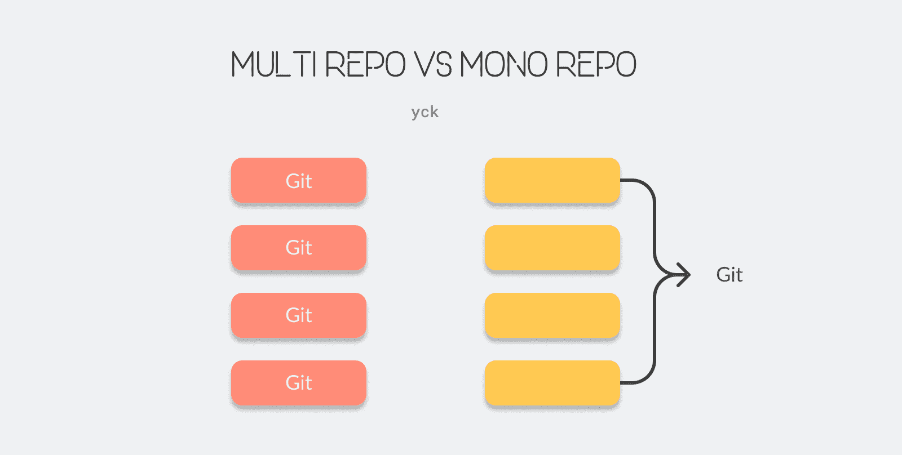

## Monorepo

Monorepo 是一种代码管理的方式，简单来说就是把多个项目整合到一个仓库内进行管理。

### Monorepo VS Multirepo

Monorepo 和 Multirepo 是当下比较流行的两种代码管理模式。

#### Multirepo

就是一个仓库对应一个项目进行开发。

**优点：**

- 便于搭建；
- 模块划分清晰；

**缺点：**

- 反应较慢，bug 修复和新功能加入都必须在目标库里修改、打包、发版本，或者维护各种`npm link`；
- 在不同的仓库间，你不仅需要处理不同的代码、工具，甚至是不同的工作流程。甚至你只能去问维护这个仓库的人，能不能为你做出改变，然后等着他们去解决（沟通成本）。
- 多个项目的内部依赖无法共享。

#### Monorepo

**优点：**
Monorepo 的优点就是针对着 Multirepo 上遇到的缺点，而统一管理代码，也可以更好地规范代码和开发流程。

**缺点：**

- 仓库变得太大，对版本控制技术会有很大的挑战。因为 Git 社区建议的是使用更多更小的代码库，Git 本身并不适合单个巨大的代码库。
- 搭建和学习成本提高，需要了解 yarn workspace 、 lerna 等 monorepo 相关的管理工具，
- 需要更加严格的代码规范来保证代码的可靠性，以保持良好的项目结构和提交测试。
