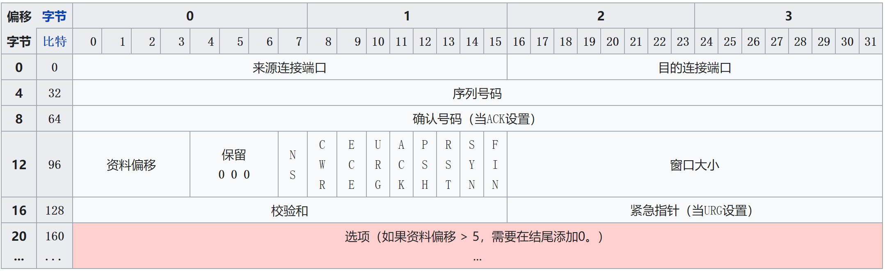
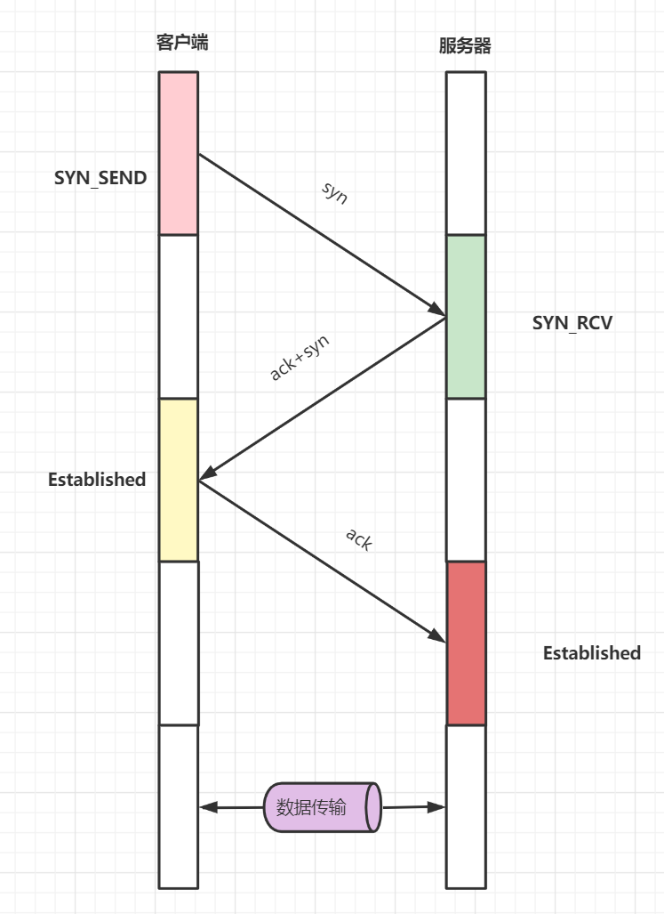
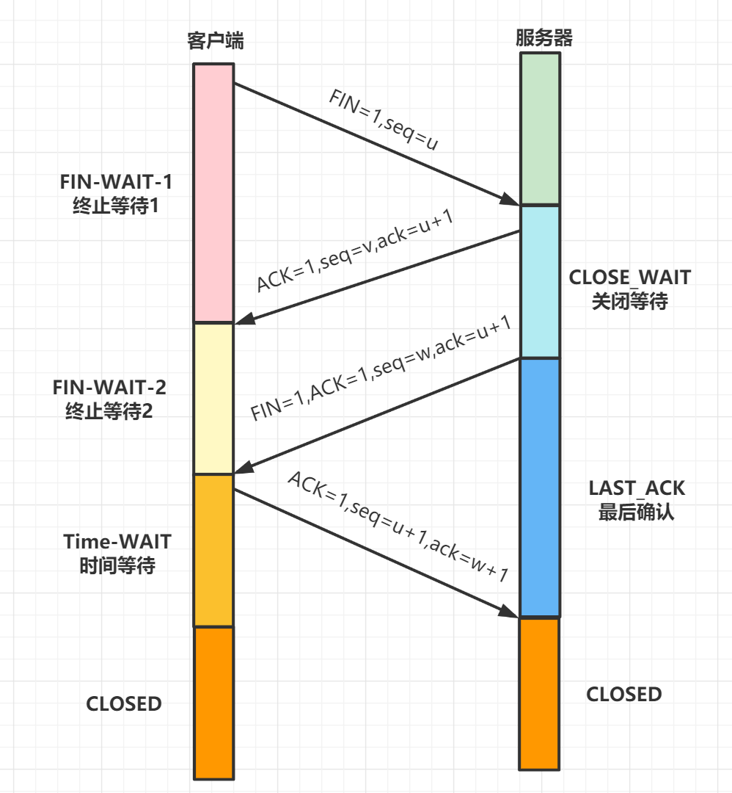

## TCP(Transmission Control Protocol)[传输控制协议]

TCP 是一种**面向连接**、**可靠的**、**基于字节流**的**传输层**通信协议。

### 运作方式

TCP 协议的运行可以分为三个阶段：**连接创建**（_connection establishment_）、**数据传送** （_data transfer_）、**连接终止**（_connection termination_）。操作系统将 TCP 连接抽象成**套接字**表示的本地端点，作为编程接口给程序使用。在 TCP 连接的生命期内，本地端点要经历一系列的状态变化。

### TCP 表头

### 三次握手

1. 客户端（通过执行 connect 函数）向服务器端**发送一个 SYN 包**，请求一个主动打开。该包携带客户端为这个连接请求而设定的**随机数 A 作为消息序列号**。
2. 服务端收到一个合法的 SYN 包后，把该包放入 SYN 列表中；**回送一个 SYN/ACK**。**ACK 的确认码应为 A+1,SYN/ACK 包携带一个随机序号 B**。
3. 客户端收到 SYN/ACK 包后，**发送一个 ACK 包，** 该包的**序号被设定为 A+1**，**而 ACK 的确认码则为 B+1**。然后客户端的 connect 函数成功返回。当服务器端收到这个 ACK 包的时候，把请求帧从 SYN 队列中移出，放至 ACCEPT 队列中；这时 accept 函数如果处于阻塞状态，可以被唤醒，从 ACCEPT 队列中取出 ACK 包，重新创建一个新的用于双向通信的 sockfd，并返回。

### 四次挥手

1. 第一次挥手(FIN=1，seq=u)，发送完毕后，客户端进入 FIN_WAIT_1 状态
2. 第二次挥手(ACK=1，ack=u+1,seq =v)，发送完毕后，服务器端进入 CLOSE_WAIT 状态，客户端接收到这个确认包之后，进入 FIN_WAIT_2 状态
3. 第三次挥手(FIN=1，ACK1,seq=w,ack=u+1)，发送完毕后，服务器端进入 LAST_ACK 状态，等待来自客户端的最后一个 ACK。
4. 第四次挥手(ACK=1，seq=u+1,ack=w+1)，客户端接收到来自服务器端的关闭请求，发送一个确认包，并进入 TIME_WAIT 状态，等待了某个固定时间（两个最大段生命周期，2MSL，2 Maximum Segment Lifetime）之后，没有收到服务器端的 ACK ，认为服务器端已经正常关闭连接，于是自己也关闭连接，进入 CLOSED 状态。服务器端接收到这个确认包之后，关闭连接，进入 CLOSED 状态。

#### 为什么要等 2MSL 才进入 CLOSED 状态？

- 1 个 MSL 保证四次挥手中主动关闭方最后的 ACK 报文能最终到达对端
- 1 个 MSL 保证对端没有收到 ACK 那么进行重传的 FIN 报文能够到达

### TCP 重传机制

#### 超时重传

发送方使用一个保守估计的时间作为收到数据包的确认的超时上限。如果超过这个上限仍未收到确认包，发送方将重传这个数据包。每当发送方收到确认包后，会重置这个重传定时器。进一步，如果重传定时器被触发，仍然没有收到确认包，定时器的值将被设为前次值的二倍（直到特定阈值）。

#### 快速重传

#### SACK

#### D-SACK
