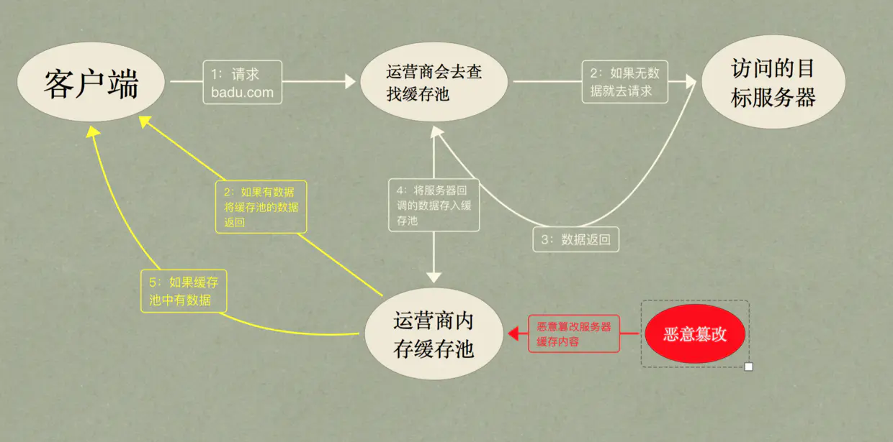

## Web 安全

### DNS 劫持

#### DNS 是什么？

DNS(Domin Name System/Domain Name Service)，域名解析系统（服务）。  
责任就是把 IP 地址映射成域名。
解析原理：

#### DNS 劫持方法

1. 本机劫持
   通过恶意程序，修改本地 DNS 配置（host 文件、缓存等）；
2. 路由劫持
   入侵路由器，修改配置
3. 攻击 DNS 服务器
   直接攻击 DNS 服务器，例如对 DNS 服务器进行 DDOS 攻击，可以是 DNS 服务器宕机，出现异常请求，还可以利用某些手段感染 dns 服务器的缓存，使给用户返回来的是恶意的 ip 地址

#### 内容劫持

