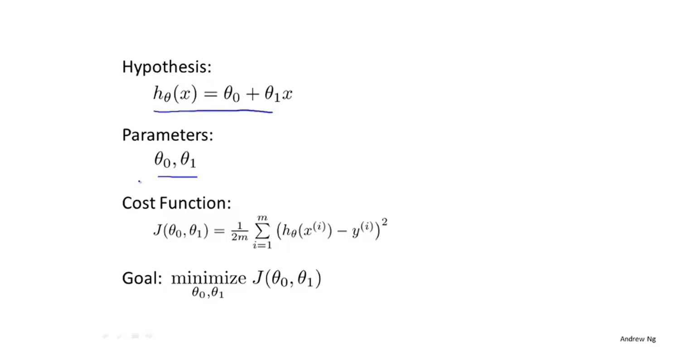
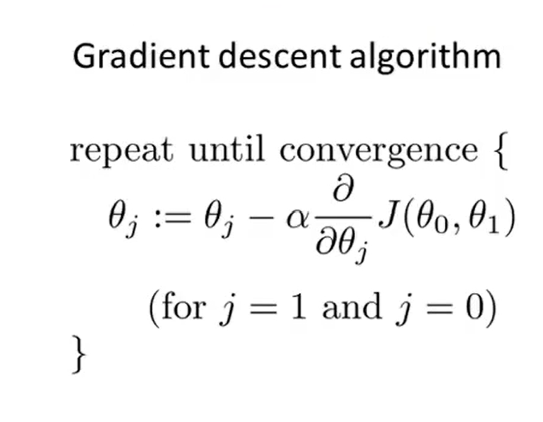
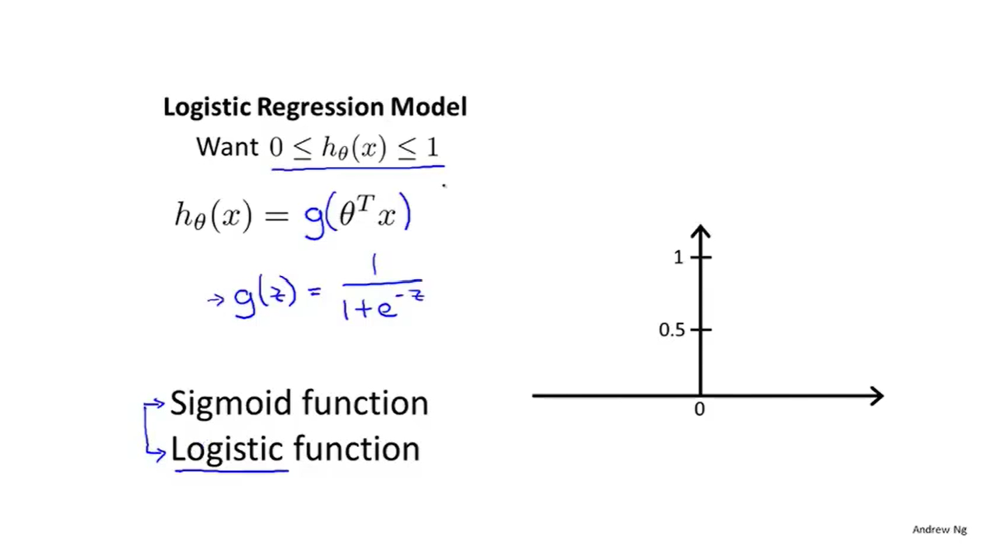
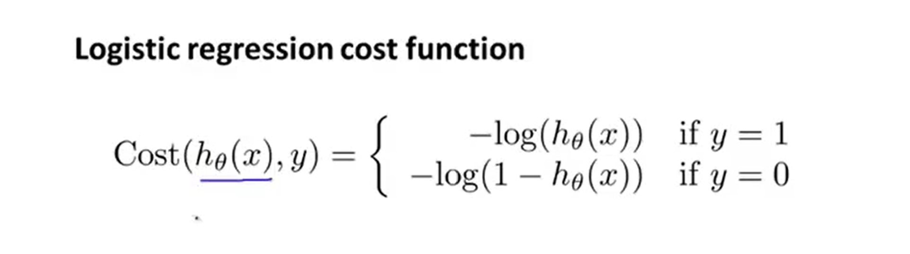

## Supervised Learning

- 回归问题
- 分类问题

Notation:

m = Number of training examples
x's = "input" variable/features
y's = "output" variable/"target" variable

###　单特性线性回归  
平方差

### 梯度下降算法（寻找局部最优解）

### Logistic Regression Model (classify questions)

hθ(x) = 输入为 x 是 y=1 的概率估计

#### Cost Function

